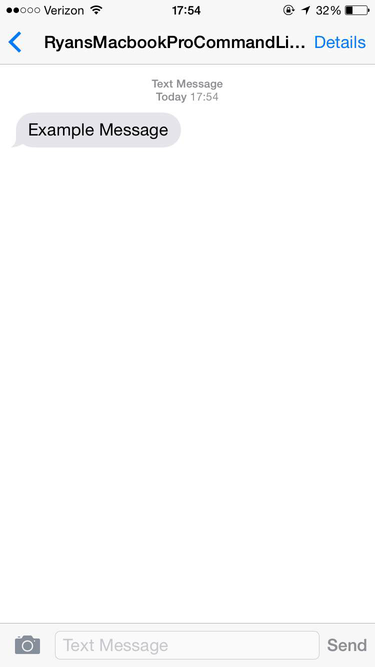

#Discovering the SMS protocol vulnerability that affects all Verizon phones

---

###How an exploit allows a man-in-the-middle attacker to spoof an SMS to any Verizon phone and allow the impersonation of any phone number and organization.

####2014
+ **Mid-December**: 
	- Viewed a question asking for help with writing a script that would send a notification to OSX's Notification Center after a bash process finished. 

	- I thought writing a similar script that sent a text notification from the command-line would be an interesting project, so I recorded it as an idea for a post-college-essay project.

####2015
+ **January 30th**: 
	- Began work on the script and chose to use **[REDACTED]**'s API because: 
		+ The daily free message quota was more than enough 
		+ Excellent API documentation and examples
	
	- Finished writing the script (working version). Included: 
		+ Hiding the confidential username and password in a separate Python file and referring to it in a similar way as Java developers do with a .properties file
		+ Sending a text to my phone with a message inputted during run-time
	
	- **Important:** Discovered that I could send texts to my *Verizon iPhone 6* model *MG652LL/A* running *iOS 8.1.3* from the text string "Ryans MacBook Pro Command Line", though when the text was received, the from address was the spaceless version ("RyansMacbookProCommandLine")

*What the text from my command line program looked like.*
**Note:** *"RyansMacbookPro..." is not the name of a contact - that is exactly what the 'from' part of the text looked like*
	
	
+ **January 31st:** **The Good Stuff**
	- Began experimenting with sending texts to myself from different recipients

	- Discovered that I could send texts from: 
		+ Any string I wanted ie. 'TDBank', 'iCloud', 'dsouzarc@facebook.com'
			- Essentially, I could use this exploit to phish for sensitive account information
		+ Any phone number I wanted: myself, my dad, my home phone, my school's office phone, a friend, a random number with an invalid number of digits
			- Each time I sent a text to my phone from a saved contact's phone number, regardless of whether or not they had Verizon, the text would show up in my previous conversation with that person
			- Essentially, I could use this exploit to send texts to people impersonating others, and those who I impersonated would have no idea they sent that message.

	- Used my program to send texts to my friends from themselves
		+ Greatly angered and confused friends --> Damage control still a W.I.P.
		+ Recorded that messages sent to friends with phones from
			- AT&T got the text from a **different** address than intended
			- Verizon got the text from the **same** address as intended
	
	- Recorded and published a video to Facebook demoing my script and how I was able to exploit the SMS vulnerability on my computer and send texts to myself from various phone numbers and text addresses. 
		+ [Link to public Facebook video] (https://www.facebook.com/video.php?v=10205404613811508&permPage=1)

+ **February 1st:** 
	- Was told by a few friends that this vulnerability in the SMS protocol was around when SMS was first released and that it grew so rapidly that the major carriers could not replace it with a more secure protocol

	- Built different variations of this python script for fun:
		+ One sent images to any phone number I put in
		+ One sent text inputted in the command-line directly to my iPhone
			- Another variant of that script sent a link, received as a command-line argument, directly to myself

	- Others